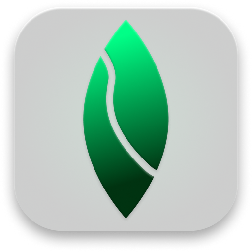

<div align="center">



# Frond

**Sticky notes that stay on your machine, stay out of your way, and don't ask you to sign in.**

[](LICENSE)
[](https://cottoncowdev.github.io)
[](https://www.electronjs.org)
> **Windows 10/11 (x64) only for now.** macOS and Linux builds are not available.
### [Download Frond for Windows](https://cottoncowdev.github.io)

*An indie project by **CottonCowDev***

<br />

</div>

---

## The Idea

When you open a sticky note, you just want to see your text **right now**. You shouldn't need an account, a sync service, or a distant server just to remember to "call John back."

Most note apps are built the other way around: sign in, sync, update, sign in again. Frond is built on a simpler idea:

> **A note is a file on your drive and a rectangle on your screen. Everything else is overhead.**

*   **Absolute local privacy.** Notes live in a single folder on your machine. There is no account and no cloud.
*   **Zero sync, zero tracking.** Frond's code includes no analytics and makes no network requests. You can verify this yourself by checking the source files. 
*   **Raw native speed.** Frameless, transparent, and hardware-accelerated. Notes appear instantly when you launch the app, right where you left them.
*   **Built for heavy multitaskers.** Whether you have ten notes or fifty, Frond is designed to stay out of your taskbar and out of your way.

Frond is for people who keep a dozen things open at once and want their notes to be as fast as a physical Post-it.

---

## Features

### Active Focus Shadow & Ecosystem Blur

Frond notices when you type and uses that behavior to protect your focus.

*   The moment you start typing, the active note **lifts toward you**. Its shadow deepens from `0 12px 40px` to `0 24px 70px`, and it scales up slightly by `1.015` using a smooth 0.4-second animation.
*   **Every other note** dims and blurs heavily (`blur(40px)` with reduced opacity), making the exact place you are writing the only sharp object on your screen.
*   When you stop typing for **800 ms**, the active note settles back down and the rest of your notes return to normal.
*   This feature is highly optimized. Frond sends **one** background communication message per typing burst, not one per keystroke. The main background process tracks a single active note, ensuring smooth handoffs without visual glitches.
*   It supports international keyboards: dead keys, special input methods, and **AltGr** modifiers (like the `@ # { } \` keys on European layouts) all count as typing. Keyboard shortcuts like `Ctrl+B` do not.

### The Ghost Host: 1 to 50 notes, ONE taskbar icon

Window clutter is what ruins most sticky-note apps. Frond solves this problem directly through its core architecture:

*   A single invisible 1×1 transparent **Ghost Host** window is the *only* window that creates a taskbar button.
*   Every note is a frameless, transparent window **owned by this host** that hides itself from the taskbar. Open 1 note or 50, and your taskbar shows exactly **one clean icon**. There are no grouped previews or massive stacks of thumbnails.
*   **Minimizing** hides every note instantly and parks the main host in the taskbar. **Clicking the icon** brings every note bursting back into view simultaneously.
*   A note window cannot be closed by accident. Standard exit shortcuts like `Alt+F4` are blocked, meaning a note only leaves your desktop when you explicitly choose to **Delete note**.
*   Opening a second copy of Frond simply brings the existing instance to the front. The two versions will never conflict or fight over your data.

### Mechanical Card Index Physics

Notes behave like physical cards in an office filing system:

*   **Stack:** Drag a note against the top edge of another and it snaps into a perfectly aligned column.
*   **Slide behind:** Drop a note onto another and it collapses into a slim tab (a small handle with a keyword label pulled automatically from its text) that peeks out above the stack. Click the tab to bring that note to the front.
*   **Pull the card:** Grab a tab and pull it upward. The card **lifts 30 px** like it is coming out of a catalog drawer, and slides back into place if you let go.
*   **Rip it out:** Keep pulling past **60 px** and the card tears free with a quick 100 ms snap. It instantly becomes an independent, free-floating note right under your cursor.

### Also under the hood

*   **Word-style rich text** (bold, underline, highlighter) built on modern native web standards, avoiding outdated code mechanisms. Toggling styles at your cursor works exactly the way you expect.
*   **Pastel highlighter wheel:** Hold the `H` button for 500 ms and a circular menu fans out with Classic Yellow, Soft Orange, and Pastel Pink options.
*   **Crash-proof storage:** Notes are saved securely by writing to a temporary file before replacing the original, backed up by a rolling `.bak` file and a plain-text `.txt` mirror of every note. If your computer loses power mid-sentence, every note returns to its exact coordinates on the next launch.
*   **Native export:** A single click opens your operating system's official "Save as" dialog, letting you save your note as a standard `.txt` file anywhere you like.
*   **Premium finish:** Enjoy smooth rounded corners, frosted glass effects, precise shadows, moss and emerald accents, alongside smooth animations for minimizing and restoring your workspace.
  
---

## Where your data lives

Frond stores everything under Electron's per-user data folder, never inside the app files:

```text
%APPDATA%\Frond\Frond_Storage\
├─ notes.json        # positions, content, formatting, stacks, theme
└─ txt_backups\      # one plain-text mirror per note
```

On first launch there is no `notes.json`, so a brand-new user starts with a clean sheet and nothing from a developer machine ever ships.

Uninstalling Frond **keeps your notes on purpose**. To wipe them for good, delete the `Frond_Storage` folder.

---

## Local Development & Build Pipeline

**Requirements:** Windows 10/11 x64, [Node.js](https://nodejs.org) 16+, Git.

```bash
# 1. Clone the repository
git clone https://github.com/CottonCowDev/frond.git
cd frond

# 2. Install developer dependencies
npm install

# 3. Run in dev mode
npm start

# 4. Compile the production installer (electron-builder, NSIS target)
npm run dist
```

The installer lands in `dist/` as `Frond-Setup-<version>.exe`, for example `Frond-Setup-1.0.0.exe`.

### Project layout

```text
frond/
├─ main.js          # Ghost Host, window lifecycle, storage, IPC
├─ index.html       # note UI + renderer logic
├─ style.css        # glass, shadows, animations
├─ icon.ico         # taskbar / installer icon
├─ package.json     # scripts + electron-builder config
└─ .github/assets/  # logo, screenshots
```

---

## Ecosystem Architecture: Two Repos, On Purpose

Frond is split across **two repositories** to keep each one honest:

| Repository | What it holds |
| --- | --- |
| **[`frond`](https://github.com/CottonCowDev/frond)** *(you are here)* | The open-source codebase, build pipeline and documentation. Nothing else. |
| **[`CottonCowDev.github.io`](https://github.com/CottonCowDev/CottonCowDev.github.io)** | The minimalist, 7-Zip-style download site (GitHub Pages) and the compiled installer, served at [cottoncowdev.github.io](https://cottoncowdev.github.io). |

**Why this repo has no `.exe` in it:**

- Compiled binaries bloat a Git history forever, and every rebuild makes it worse.
- A source repo should be readable top to bottom in an afternoon. A pile of build junk isn't.
- You should never have to wonder whether the thing you're reading is the thing that's running. Source lives here, and the installer is built from it with `npm run dist`.

**Just want to use Frond?** Don't clone anything. Grab the installer from the download site:

### 👉 [**cottoncowdev.github.io**](https://cottoncowdev.github.io)

Everything build-related (`dist/`, `node_modules/`, `*.exe`) is git-ignored. If you ever see a binary in a pull request here, it gets sent back.

---

## Contributing

Issues and pull requests are welcome. Keep it small, keep it local-first, and keep it fast. A change that adds a network call, an account or a telemetry ping is not going to be merged.

## License

[MIT](LICENSE) © 2026 CottonCow

<div align="center">

<sub>Made in 72 hours as a hate letter towards Microsoft</sub>

</div>
